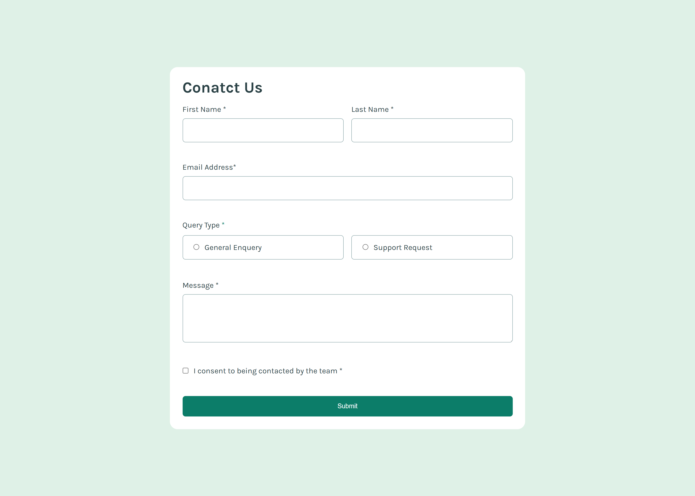

# Frontend Mentor - Contact form solution

This is a solution to the [Contact form challenge on Frontend Mentor](https://www.frontendmentor.io/challenges/contact-form--G-hYlqKJj). Frontend Mentor challenges help you improve your coding skills by building realistic projects.

## Table of contents

- [Overview](#overview)
  - [The challenge](#the-challenge)
  - [Screenshot](#screenshot)
  - [Links](#links)
- [My process](#my-process)
  - [Built with](#built-with)
  - [What I learned](#what-i-learned)
  - [Continued development](#continued-development)
  - [Useful resources](#useful-resources)
- [Author](#author)
- [Acknowledgments](#acknowledgments)

**Note: Delete this note and update the table of contents based on what sections you keep.**

## Overview

### The challenge

Users should be able to:

- Complete the form and see a success toast message upon successful submission
- Receive form validation messages if:
  - A required field has been missed
  - The email address is not formatted correctly
- Complete the form only using their keyboard
- Have inputs, error messages, and the success message announced on their screen reader
- View the optimal layout for the interface depending on their device's screen size
- See hover and focus states for all interactive elements on the page

### Screenshot



### Links

- [Solution URL](https://your-solution-url.com)
- [Live Site URL](https://unique-mochi-f53687.netlify.app/)

## My process

### Built with

- Semantic HTML5 markup
- CSS custom properties
- Flexbox
- CSS Grid
- Mobile-first workflow

**Note: These are just examples. Delete this note and replace the list above with your own choices**

### What I learned

This one has been one of the longer projects mostly because I wasn't sure on many things. I suppose it was a bunch of trial and error on my part. Then after everything was figured out I was trying to consolidate my code even more. I think it could go through even more revision, which I won't do just now. Also I had a lot of form elements to figure out, as well as pseudo code to get to said elements attributes. This one was a complicated one, but I did good.

```css
input[type="radio"]:checked::before {
  ...;
}
input[type="checkbox"]:checked::before {
  ...;
}
```

```js
function suceessBox() {
  const errorPoints = document.querySelectorAll(".error-msg.on");
  console.log(errorPoints.length);
  if (errorPoints.length === 0) {
    const successMsg = document.getElementById("successMsg");
    successMsg.style.display = "block";
  }
}
```

### Continued development

I'd like to better understand forms as well as tying them onto a backend like databases, but also elements available, and better ways when it comes to styling and handling.

### Useful resources

- [Resource 1](https://developer.mozilla.org/en-US/docs/Learn_web_development/Core/CSS_layout/Grids) - Incase you forget how to style a grid.
- [Resource 2](https://stackoverflow.com/questions/23167637/is-it-possible-to-change-the-color-of-selected-radio-buttons-center-circle) - Pseudo CSS for radio, and checkbox.
- [Resource 3](https://developer.mozilla.org/en-US/docs/Web/HTML/Element/textarea) - Forgot how to set up parts of a form like a text area.
- [Resource 4](https://www.geeksforgeeks.org/how-to-validate-email-address-using-regexp-in-javascript/) - Regex to validate email input.

## Author

- Website - coming soon....
- Frontend Mentor - [@moncadad](https://www.frontendmentor.io/profile/moncadad)

## Acknowledgments

Shout of to anyone that writes on all the platforms developers frequent because boy did I seek help for this one haha!
